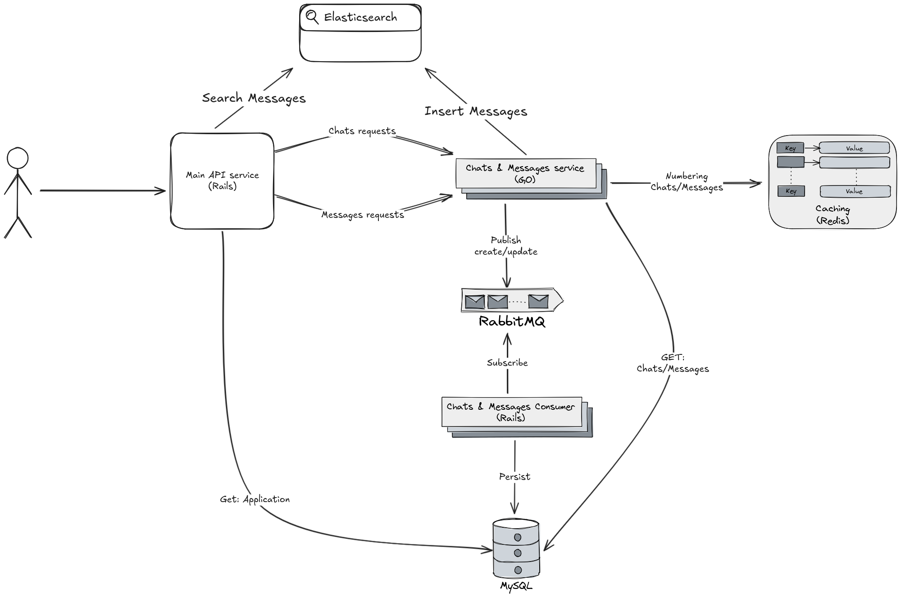

# Chat App
A small system-design challenge to practice and tinker with `{ "docker", "GoLang", "Ruby-on-Rails", "MySQL", "RabbitMQ", "ElasticSearch" }`

## What are we serving today? 🍽️

- [Business Requirements](#business-requirements)
- [The Approach](#the-approach)
- [Run it](#run-it)
- [Remaining Enhancements](#remaining-enhancements)
- [🚧 Work in progress 🚧](#-work-in-progress-)

## Business Requirements

Our goal is to build a _scalable_ & robust chat app that contains the following requirements:

- **Business Entities**:
	1. **Application** (**aka.** User), can have many chats.
	2. **Chat**, can have many messages.
	3. **Message**.
- **Chats** and **Messages** have a number that increments _for each **Application** and **Chat** respectively_.
- Client can Create/Read/Update **Applications**/**Chats**/**Messages**, and search messages.
- Client can search **Messages**.

## The Approach

The system is designed as a microservices architecture, with the following components:

1. **Main App (Ruby on Rails)**: Accepts HTTP requests for the the app resources. Serves the **Application** resource requests, and redirects other requests back to Go service.
2. **Chats/Messages Service (Go)**: Handles the **Chat**/**Message** creation/update by generating a number for the resource and publishing a RabbitMQ-message. And reading **Chat**/**Message** goes directly to MySQL.
3. **RabbitMQ**: A message broker to act as a medium between the Rails/Go services and MySQL for asynchronous communication.
4. **Ruby-Whenever (Cron)**: A background processes to count **Chats** and **Messages** periodically and persist results in MySQL as a method of caching.
5. **Consumer (Ruby)**: Consumes **Chats**/**Messages** published RabbitMQ-messages for resources creation/update and serve send a bulk insert/update in MySQL.
6. **Elasticsearch**: Searching **Messages**.
7. **Redis**: For caching chats and messages numbers.
8. **RDBMS (MySQL)**: Stores **Applications**/**Chats**/**Messages**.

### System Architecture Diagram



## Run it

To run the system locally, follow these steps:

1. **Clone the repository**:

```bash
   git clone https://github.com/ShadyZekry/chat-app.git
   cd <repository-directory>
```

2. **Build and Run Docker Containers**:

```bash
   docker-compose up --build
```

3. **Access the system** (for inspection):
	1. Create Application
		``` Bash
		curl --location 'localhost:3000/api/v1/applications' \
	         --form 'name="application-name"'
		```
	2. Get Application
		``` Bash
		curl --location 'localhost:3000/api/v1/applications/1d763d85-1b08-4941-97fe-e6937931054f'
		```
	3. Update Application
		``` Bash
		curl --location --request PUT 'localhost:3000/api/v1/applications/1d763d85-1b08-4941-97fe-e6937931054f'
		```
	4. Create Chat
		``` Bash
		curl --location 'localhost:8080/api/v1/applications/1d763d85-1b08-4941-97fe-e6937931054f/chats' \
		--form 'name="name2"'
		```
	5. Get Chat
		``` Bash
		curl --location 'localhost:8080/api/v1/applications/1d763d85-1b08-4941-97fe-e6937931054f/chats/4'
		```
	6. Update Chat
		``` Bash
		curl --location --request PUT 'localhost:8080/api/v1/applications/1d763d85-1b08-4941-97fe-e6937931054f/chats/4' \
		--form 'name="test"'
		```
	7. Create Message
		``` Bash
		curl --location 'localhost:8080/api/v1/applications/1d763d85-1b08-4941-97fe-e6937931054f/chats/4/messages' \
		--form 'name="name2"'
		```
	8. Get Message
		``` Bash
		curl --location 'localhost:8080/api/v1/applications/1d763d85-1b08-4941-97fe-e6937931054f/chats/4/messages/3'
		```
	9. Update Message
		``` Bash
		curl --location --request PUT 'localhost:8080/api/v1/applications/1d763d85-1b08-4941-97fe-e6937931054f/chats/4/messages/3' \
		--form 'name="test"'
		```

	10. Check the internals (For inspection not as APIs)
	   - Main App: `http://localhost:8080`
	   - Redis: `http://localhost:6379`
	   - RabbitMQ admin-panel: `http://localhost:15672`
		   - Username: `guest`
		   - Password: `guest`
	   - Elasticsearch: `http://localhost:9200`
	   - MySQL: `localhost:3306`
	    - Username: `root`
	    - Password: `password`

## Remaining Enhancements

### API Security

- **Rate Limiting**: Implement rate limiting to prevent abuse and ensure fair usage.
### Testabillity

- **Adding Specs**: Add unit tests to the codebase to ensure reliability and maintainability.

### Resiliency

- **Retry Mechanism**: Add retry mechanisms for transient failures in asynchronous communication between microservices.

### Other Enhancements

- **Monitoring and Logging**: Enhance monitoring and logging to gain better insights into the system's behavior and performance.
- **Data Coalescing**: Combine multiple Create/Update requests on the Consumer lever to reduce the hit on MySQL.

# 🚧 Work in progress 🚧
- Elastic search is not yet fully configured.
- **Application** goes directly to MySQL. The idea behind that decision is that **Application** creation should not have that huge impact on the system relative to **Chats**/**Messages**.
